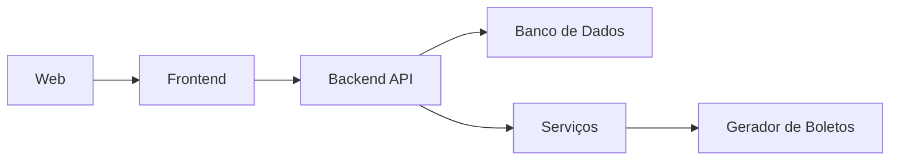

# Documento de Arquitetura de Software  
**Sistema de Gestão Financeira e Operacional para Terraplanagem**  
*Versão 1.0 | Última atualização: 2024-06-20*

---

## 1. **Arquitetura do Sistema**  
### 1.1 Tipo de Arquitetura  
- **Backend**:  
  - **API REST** (Next.js)  
  - **Camada de Negócio** (Regras financeiras, cálculos)  
  - **Banco de Dados** (Firebase)  
- **Frontend**: **MVC** (React.js)  
- **Comunicação**: HTTPS (JSON)  

### 1.2 Diagrama de Componentes  

---

## 2. **Componentes Principais**  
| Componente          | Tecnologia           | Descrição                                  |  
|---------------------|----------------------|--------------------------------------------|  
| **Frontend**        | React.js             | Dashboards, formulários e relatórios       |  
| **Backend**         | Next.js              | API REST para processamento de dados       |  
| **Banco de Dados**  | Firebase/Vercel/Render             | Armazena transações, projetos e usuários   |  
| **Autenticação**    | JWT + OAuth2         | Controle de acesso e MFA                   |  

---

## 3. **Requisitos Atendidos**  
### 3.1 Funcionais  
| ID   | Descrição                          | Solução Proposta                     |  
|------|------------------------------------|--------------------------------------|  
| RF03 | Alertas de vencimentos             | Cron jobs no backend                 |  
 

### 3.2 Não Funcionais  
| ID    | Descrição                          | Solução Proposta                     |  
|-------|------------------------------------|--------------------------------------|  
| RNF05 | Autenticação MFA                   | JWT + OAuth2                         |  
| RNF08 | Disponibilidade 99.9%              | Firebase/Vercel/Render               |  

---

## 4. **Infraestrutura**  
### 4.1 Hardware  
| Ambiente         | Especificações                          |  
|------------------|-----------------------------------------|  
| **Desenvolvimento** | CPU 4 núcleos, 8GB RAM, SSD 256GB     |  
| **Produção**      | Firebase/Vercel/Rendel                 |  

### 4.2 Comunicação  
- **Frontend ↔ Backend**: API REST (HTTPS)  
- **Backend ↔ Banco de Dados**: Conexão TLS via ORM  

---

## 5. **Próximos Passos**  
1. [ ] Prototipar interfaces (Figma)  
2. [ ] Documentar APIs com Swagger  

---
